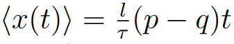
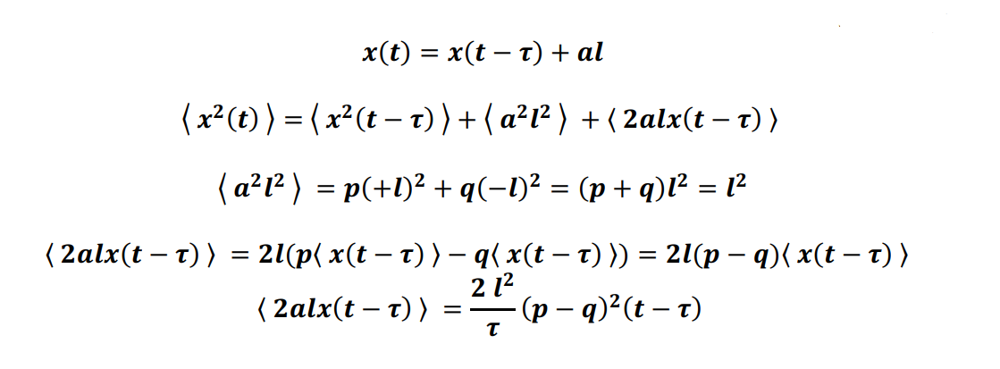
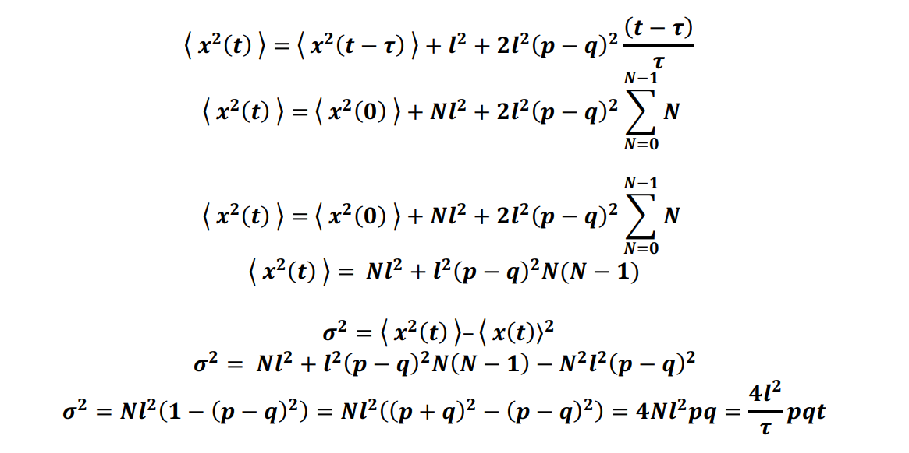

## 1-D Random Walk
### Variance and Average
Average: 
  
Variance:

In this assignment, I demonstrate the accuracy of these equations by using simulation. 
### Random Walk with Absorbing Boundary
In this part, L is the number of the existing nodes. I simulated how the expected lifetime of a random walker on a line depends on its initial position and the probability of moving to the right at each step.
We can see that, as the probability of going right increases, random walkers that start on the left side of the line tend to have a longer lifetime, because they are less likely to reach the right end of the line, which is the absorbing state. 
We can solve this problem using deterministic approach, instead of simulation. I write the code and get the exact result, too.

## 2-D Random Walk

## Diffusion limited Aggregation (DLA)
In this part, I simulated 2-D random walk and used it for DLA algorithm.
DLA is the formation of clusters by particles diffusing through a medium that jostles the particles as they move.
For simulating DLA, I used the following steps: 
1. Define a network with just the value of the first row equals to one. This represents the seed of the cluster, where the particles will stick to.
2. Choose a neighbor randomly. If the node has value one, the node that we are currently in becomes one too.
This represents the particle sticking to the cluster.
3. Go back to step 2 and repeat until the desired cluster size is reached.

